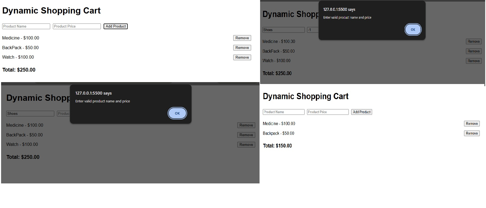

### Reflections - Dynamic SHopping Cart

### How did you dynamically create and append new elements to the DOM?

I used document.createElement() to create new list items for each product and then set the content using input values. After that, I appended the item to the cart using appendChild() so it gets displayed on the screen.

### What steps did you take to ensure accurate updates to the total price?

I converted the price input into a number using parseFloat() before using it in calculations. Then I used a separate function to update the total and ensured it updates both add and remove actions correctly.

How did you handle invalid input for product name or price?

I added validation to check if the name is empty or if the price is not a valid number or less than or equal to zero. If invalid input is found, I show an alert and stop the function using return.

### What challenges did you face when implementing the remove functionality?

Initially, I had issues with retrieving the correct price because of dataset mismatches and string values. Then I fixed it using closest('li'), dataset.price, and proper number conversion to update total correctly.

### ScreenShot

Things to add:

If incorrect values are added in the input field, the fields are not clearing
Need to add qunatity
