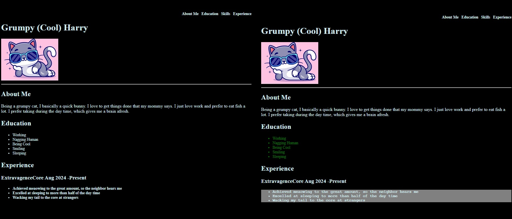

# Project Grumpy Cat Resume

This is the playful resume of a grumpy cat. It shows a cat who is quick and loves getting things done, enjoys fish, naps during the day, and keeps the brain fresh. Education includes working, nagging humans, being cool, smiling, and sleeping. Experience highlights meowing loudly for attention, sleeping most of the day, and wagging the tail at strangers.

### ScreenShot

### Test Steps for Grumpy Cat Resume Interactivity

1. Open the Grumpy Cat resume in a browser.
2. Click on any education item and verify that its  **text color changes** .
3. Click on the experience container and verify that the  **font style toggles** .
4. Click again on the Experience container and verify that the **background changes** if that feature is enabled.
5. Repeat clicks to confirm the toggles work consistently.
