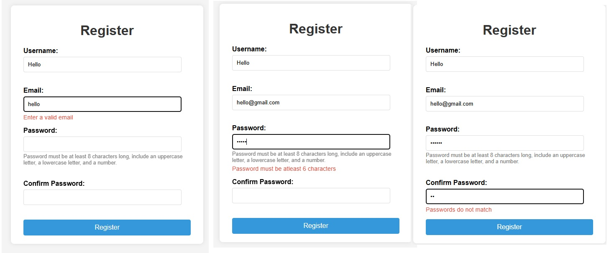
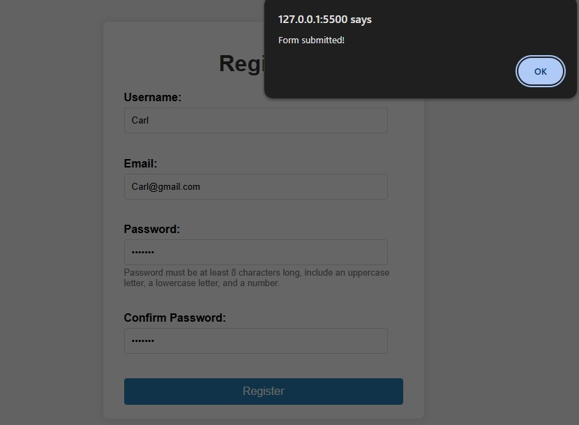
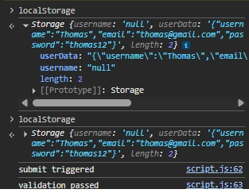

### User Registration Form

This is a simple user registration form with Username, Email, Password, Confirm Password and Submit Button. Each of the field has validation and once the form is submitted sucessfuly, you will get an alert of "Form Submitted!". In the following section you can find the testing and validation and screen shots which will help to easily understand what is happening in this form.

### Screenshot

Local Storage image from the Chrome DevTools

### Testing and Validation

- [X] Test Basic Registration
- [X] Fill out all fields with valid data and submit the form.
- [X] Verify the success message. The username is saved in localStorage -
- [X] Test Username Validation
- [X] Submit with an empty username.
- [X] Enter a username that is too short.
- [X] Verify error messages appear in real-time as you type
- [X] Test Email Validation
- [X] Submitting with an empty email.
- [X] Enter an invalid email format (e.g., “test@”, “test.com”).
- [X] Test Password Validation
- [X] Try submitting with an empty password.
- [X] Enter a password that is too short.
- [X] Enter a password that doesn’t meet the pattern (e.g., all lowercase, no numbers).
- [X] Ensure the “Confirm Password” field shows an error if it doesn’t match the password.

Test Local Storage Persistence** : After a successful registration, refresh the page. The username field should be pre-filled with the value you entered.
**Edge Cases** : Think about what happens if a user tries to bypass validation (though client-side validation is mainly for UX, server-side is for security). What happens if `localStorage` is full or disabled (for this lab, we assume it works, but it’s a real-world consideration)?

### Reflections: 

**1. How did event.preventDefault() help?**

It stopped the page from refreshing when I clicked submit and This allowed my validation and save logic to run properly.

2. **HTML validation vs JavaScript validation?**

HTML validation is built-in and quick (like required, email type). JavaScript gives more control for custom checks like password match.

3. **How did you use localStorage + limitations?**

I stored user data using localStorage.setItem() and loaded it using getItem() on page load. It is not secure, so sensitive data like passwords should not be stored.

4. **Challenge in real-time validation?**

Sometimes validation was not triggering correctly while typing. I fixed it by adding input event listeners for each field.

5. **How did you handle user-friendly error messages?**

I used separate `` elements to show errors below each field. Messages are shown only when invalid and cleared when input becomes correct.
