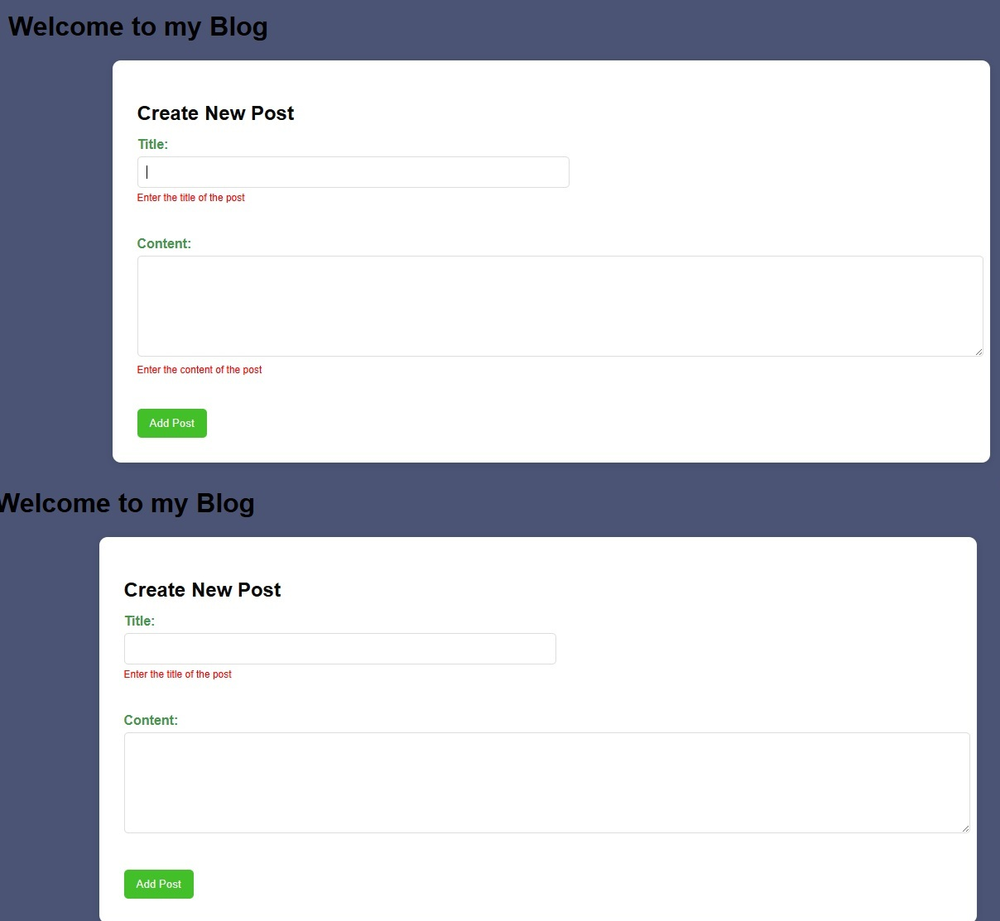

## Personal Blog SBA

Built a simple blog app where users can add, edit, and view posts dynamically using JavaScript. Implemented form validation and used localStorage to persist data even after refresh. Focused on DOM manipulation and clean UI updates by re-rendering posts efficiently.

### How to Run:

Open the `index.html` file in any browser to run the application. No installation or setup is required since it’s built using basic HTML, CSS, and JavaScript.

Ensure JavaScript is enabled so posts can be added and saved properly.

### Screenshots, Gifs, Videos


```
[watch Video<video width="320" height="240" controls>
```




### **Testing**

**Test All Features Thoroughly:**

Tested all the cases beliow anf it is working.

Adding new posts with valid and invalid data.

* Display of posts.
* Editing posts (ensure correct post is updated).
* Deleting posts.
* Persistence: Refresh the page, close and reopen the browser to ensure posts are saved and loaded correctly from `localStorage`.

**Review Code:** Check for any errors, improve readability, and add comments where necessary.

### **Reflections**

**Development process:** Started with basic form and validation, then added dynamic post rendering, Gradually integrated localStorage to persist data across refresh.
Finally implemented edit functionality by restructuring the save and render logic.

**Challenges faced:** Had issues with posts not rendering and handling empty values after form reset. Edit functionality was tricky, especially tracking the correct index.
Also faced errors like date not populating, had some style issues. etc.,

**How I overcame them:** Used console logs and debugging to trace where the code was breaking. Fixed logic by separating concerns (render, save, edit functions clearly). Reworked the flow step-by-step until add and edit features worked correctly.
